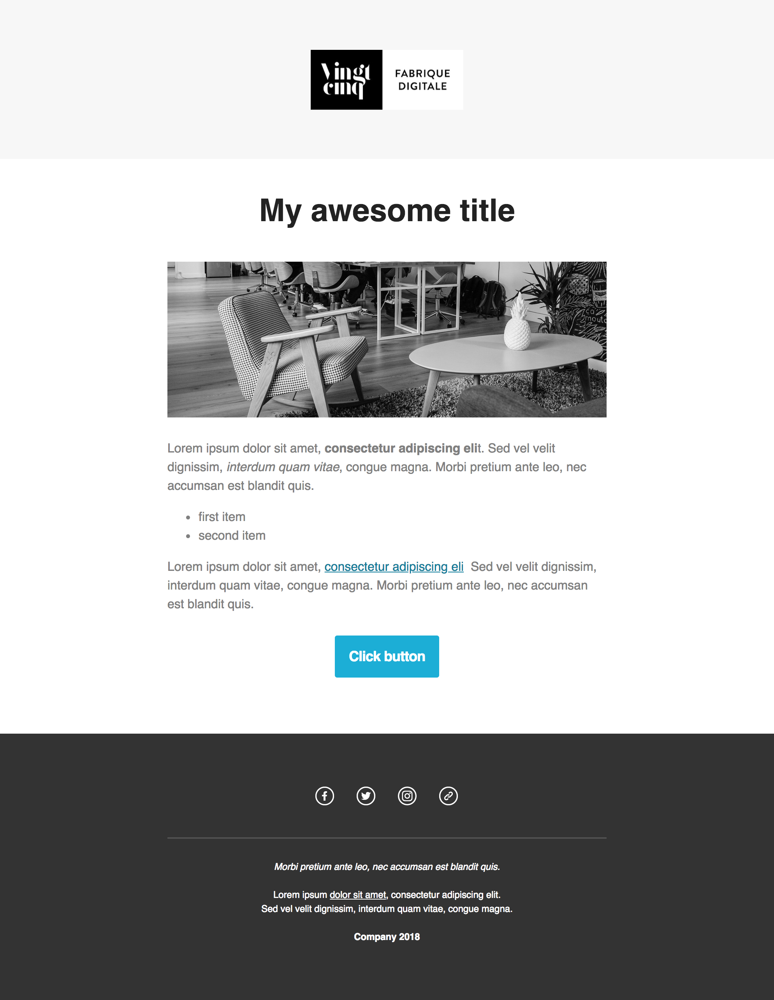
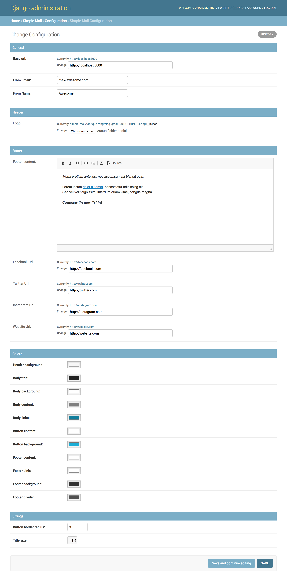
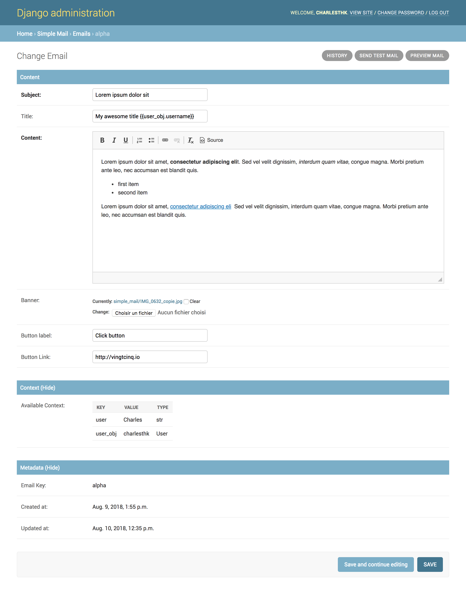

[](https://pypi.python.org/pypi/django-simple-mail)


# django-simple-mail

Simple customizable email template built for Django

The 2.* versions have breaking changes from the 1.* and are not backward compatible.

## Template preview

The base template was built with [Mailchimp](https://mailchimp.com/) editor :



## Requirements

These Django app works with :

+ Python (>=2.7)
+ Django (>=1.9) (Need to be tested for previous versions)


## Installation

Install using `pip` :

`pip install django_simple_mail`

Add `simple_mail` to your INSTALLED_APPS settings.

```python
INSTALLED_APPS = (
    ...
    'simple_mail',
    ...
)
```

Then run :

`python manage.py migrate`

### WYSIWYG

Simple Mail easily integrates with `django-ckeditor` to have a wysiwyg edition of content.
To use it :

`pip install django-ckeditor`

Then add `ckeditor` to your INSTALLED_APPS settings.

```python
INSTALLED_APPS = (
    ...
    'ckeditor',
    ...
)
```

And set the following in your settings :

`SIMPLE_MAIL_USE_CKEDITOR = True`


## Create and Register mails

Create a `mails.py` file in your app and define your mail :

```python
from simple_mail.mailer import BaseSimpleMail, simple_mailer


class WelcomeMail(BaseSimpleMail):
    email_key = 'welcome'


simple_mailer.register(WelcomeMail)
```

Then run `./manage.py register_mails` to create those mail into the database.

The mail with key `welcome` will he be available for edition in your django admin.

## Send an email

You can the send the `WelcomeEmail` the following way :

```python
welcome_email = WelcomeEmail()
welcome_email.set_context(args, kwargs)
welcome_email.send(to, from_email=None, bcc=[], connection=None, attachments=[],
                   headers={}, cc=[], reply_to=[], fail_silently=False)
```

## Mail configuration & edition

### Customize your base content and template colors

You change the look and feel or your template directly from the django admin :
The **Footer** field can use template tags and variables.



### Edit the content of each of your mail :

You can edit the content of each of your mail.
The **Content**, **Subject**, **button label** and **button link** fields can use template tags and variables.



## Custom template

You can define your own email template :

By setting a `template` attribute from you `BaseSimpleMail`subclass :

```python
from simple_mail.mailer import BaseSimpleMail, simple_mailer


class WelcomeMail(BaseSimpleMail):
    email_key = 'welcome'
    template = 'my_app/my_email_template.html'


simple_mailer.register(WelcomeMail)

```

Or by setting `SIMPLE_MAIL_DEFAULT_TEMPLATE` in your settings :

```python
SIMPLE_MAIL_DEFAULT_TEMPLATE = 'my_app/my_email_template.html'

```


## Support

If you are having issues, please let us know or submit a pull request.

## License

The project is licensed under the MIT License.